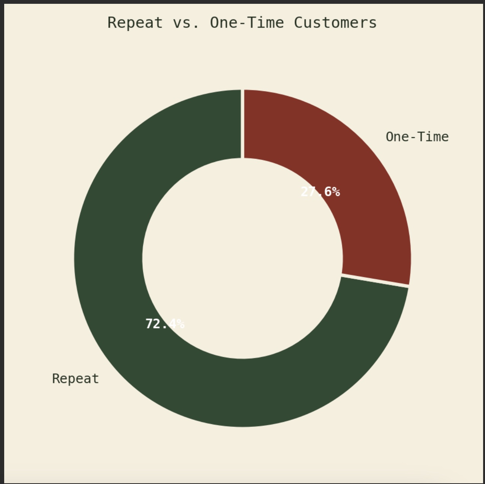
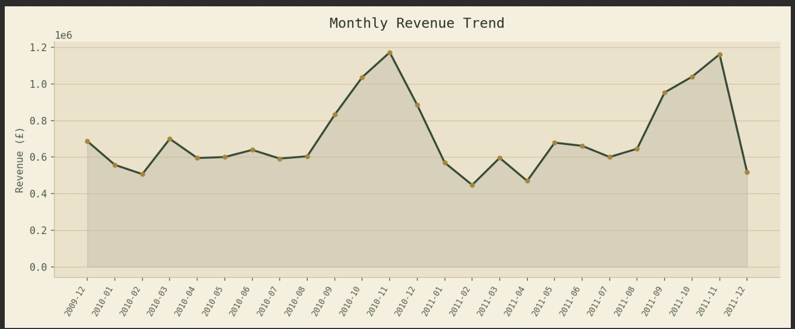
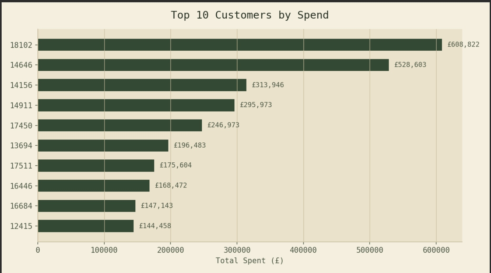
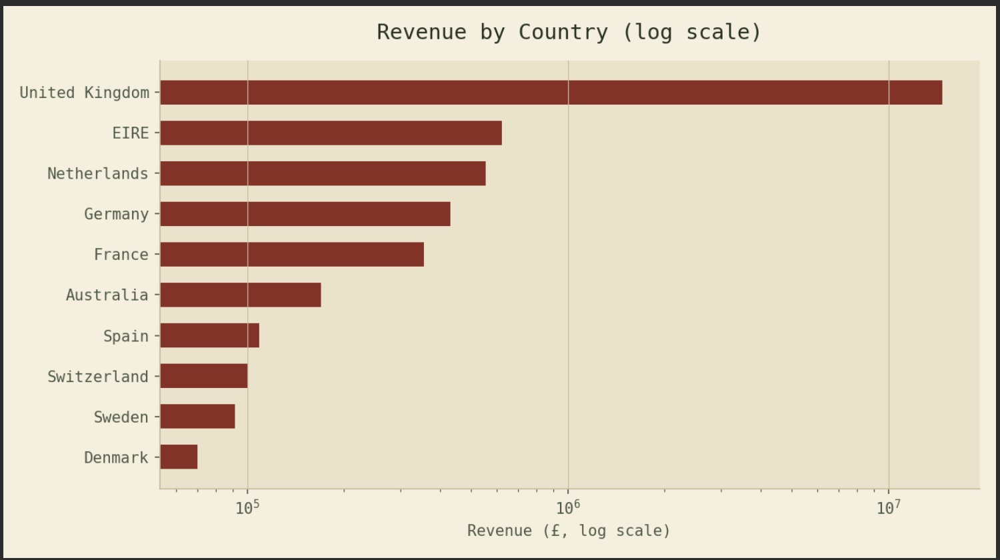

# Customer Retention & Transaction Behavior Analysis (SQL)

## Project Overview

This project analyzes transaction-level retail data to evaluate customer retention, repeat purchase behavior, and revenue trends using SQL, with results validated in Python and visualized in an interactive dashboard.

## Dataset

- [UCI Online Retail II](https://archive.ics.uci.edu/dataset/502/online+retail+ii)
- ~1,067,000 raw transaction records → 805,620 after cleaning
- Fields: Invoice, Quantity, Price, Customer ID, Country, InvoiceDate
- `sample_data.csv` in this repo contains the first 500 raw rows for reference (full dataset not included due to size — download from the source link above)

## Key Analysis Performed

- Data cleaning (removed null customers and returns)
- Revenue calculation
- Customer segmentation (One-time vs Repeat)
- Retention rate calculation
- High-value customer identification
- Monthly revenue trends
- Revenue by country

## Results

Computed from `online_retail_ii` after removing null customers and returns (805,620 clean transaction lines, Dec 2009 – Dec 2011).

| Metric | Value |
|---|---|
| Total Revenue | £17,743,429 |
| Unique Customers | 5,881 |
| Average Order Value | £479.88 |
| Retention Rate | **72.35%** |
| Repeat Customers | 4,255 |
| One-Time Customers | 1,626 |

**Top 5 customers by lifetime spend:** 18102 (£608,822), 14646 (£528,603), 14156 (£313,946), 14911 (£295,973), 17450 (£246,973).

Revenue is seasonal, peaking every October–November before dropping sharply in December. The UK accounts for ~83% of revenue; EIRE, Netherlands, and Germany are the next-largest markets.

### Visualizations

| Repeat vs. One-Time Customers | Monthly Revenue Trend |
|---|---|
|  |  |

| Top 10 Customers by Spend | Revenue by Country |
|---|---|
|  |  |

## Interactive Dashboard

`dashboard.html` is a self-contained interactive dashboard (Chart.js) covering all metrics above. Open it directly in a browser, or enable GitHub Pages (Settings → Pages → Deploy from branch → `main` → `/`) to view it live.

## Files

| File | Description |
|---|---|
| `project_queries.sql` | Full SQL analysis (MySQL) |
| `analyze.py` | Python/pandas script reproducing the same cleaning & aggregation logic, used to validate SQL results |
| `dashboard.html` | Interactive HTML dashboard |
| `sample_data.csv` | 500-row sample of the raw dataset |
| `dataset_info.txt` | Dataset field descriptions |
| `screenshots/` | Static PNG exports of the dashboard's charts |

## Tools Used

- MySQL — SQL (Aggregation, Subqueries, CASE, GROUP BY, HAVING)
- Python (pandas) — validation of SQL results
- Chart.js / HTML — interactive dashboard

## Business Relevance

This analysis demonstrates how transaction data can be used to evaluate customer engagement and retention strategies in retail and financial services — identifying which customers to retain, when demand peaks, and where revenue concentration creates risk or opportunity.